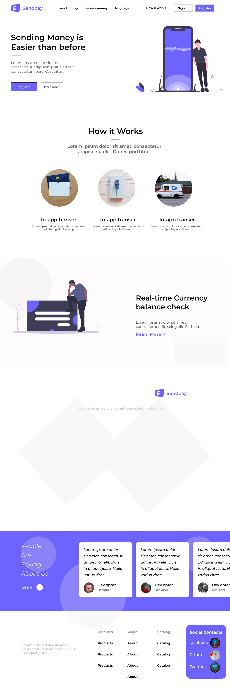

# SendPay - Next.js Web App

SendPay is a modern money transfer web application built using **Next.js** and **Tailwind CSS**. It provides users with a seamless and intuitive interface for sending and receiving money securely.

## 🚀 Features

- User authentication (Sign-in & Register)
- In-app money transfers
- Real-time currency balance check
- Responsive and modern UI
- Client-side and server-side rendering with Next.js
- Component-based architecture for scalability

## 📂 Folder Structure

```
.next/                # Next.js build files (auto-generated)
.vercel/              # Deployment settings for Vercel (if used)
node_modules/         # Installed dependencies
public/               # Static assets (e.g., images, icons, etc.)
src/
  ├── app/            # Main application directory
  │   ├── components/ # Reusable UI components
  │   │   ├── Currency.tsx   # Currency balance check component
  │   │   ├── Feedback.tsx   # User feedback/testimonials
  │   │   ├── Footer.tsx     # Footer section
  │   │   ├── Header.tsx     # Navigation header
  │   │   ├── Hero.tsx       # Hero section (main banner)
  │   │   ├── Services.tsx   # Services section
  │   ├── layout.tsx   # Layout component for consistent page structure
  │   ├── page.tsx     # Main landing page

.gitignore            # Files to exclude from Git
.hintrc               # Code linting rules
eslint.config.mjs     # ESLint configuration
next-env.d.ts         # TypeScript environment settings
next.config.ts        # Next.js configuration
package.json          # Project dependencies and scripts
postcss.config.mjs    # PostCSS configuration for Tailwind CSS
README.md             # Project documentation
tailwind.config.ts    # Tailwind CSS configuration
tsconfig.json         # TypeScript configuration
```

## 📸 Preview

\
*A screenshot of the application UI.*



## 🎨 Figma Design

You can find the Figma design for this project here:\
[**SendPay Figma Design**](https://www.figma.com/design/GaulAO4A3RuX6cW9TazehT/Sendpay?m=auto\&t=Cbifk5gpq2WLsew1-6)

## 🛠 Installation & Setup

1. Clone the repository:
   ```sh
   git clone https://github.com/your-username/sendpay.git
   cd sendpay
   ```
2. Install dependencies:
   ```sh
   npm install  # or yarn install
   ```
3. Run the development server:
   ```sh
   npm run dev  # or yarn dev
   ```
4. Open `http://localhost:3000` in your browser to see the app.

## 📜 Scripts

- `npm run dev` - Starts the development server
- `npm run build` - Builds the application for production
- `npm run start` - Runs the production build
- `npm run lint` - Runs ESLint for code quality checks

## 🌐 Deployment

This project is optimized for deployment on **Vercel**. To deploy:

1. Install the Vercel CLI:
   ```sh
   npm install -g vercel
   ```
2. Run:
   ```sh
   vercel
   ```
3. Follow the CLI instructions to deploy your app.

## 🛡 Tech Stack

- **Framework**: Next.js (React)
- **Styling**: Tailwind CSS
- **Language**: TypeScript
- **Deployment**: Vercel

## 📧 Contact

For questions or support, contact [**rrabeeshussain@gmail.com**](mailto\:rrabeeshussain@gmail.com).

---

Made with ❤️ using Next.js & Tailwind CSS
